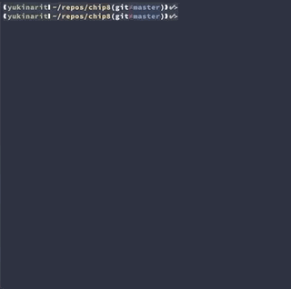

Chip8 emulator written in Rust [](https://travis-ci.com/yukinarit/chip8)
==============================




A simple implementation of Chip-8 emurator in Rust programming language.

What's Chip8?
-------------

Chip-8 is a small virtual machine designed for gaming in 1980s. Because of its simplicity, there are [implementations](https://github.com/topics/chip8) in many programming languages. I recommend you to try implementing your own chip8!

Requirements
------------

* Linux / Mac
* Rust >= 1.31

Usage
-----

* Run chip8
	```
	$ cd chip8
	$ cargo run ../roms/INVADERS
	```

* See trace log
	```
	# RUST_LOG=trace cargo run ../roms/INVADERS
	```

* Change FPS(Frame per second)
	```
	$ cargo run <ROM> -f 30
	```

* Change FPS and Cycle per frame
	```
	# cargo run <ROM> -f 30 -c 20
	```

* Run c8db
	```
	$ cd c8db
	$ cargo run -p c8db <ROM>
	```

License
-------

Chip8, along with all its associated documentation, examples and tooling, are made available under the [MIT license](https://opensource.org/licenses/MIT). See LICENSE for additional details.
